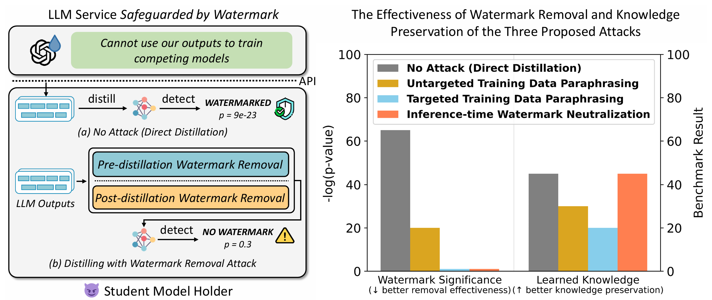
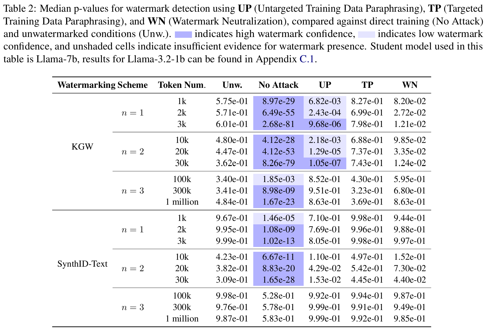
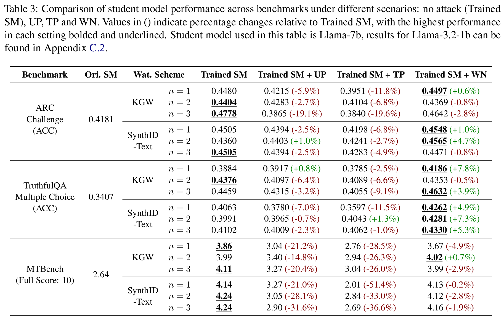

# Watermark-Radioactivity-Attack
Code and data for paper "Can LLM Watermarks Robustly Prevent Unauthorized Knowledge Distillation".



## Introduction
The radioactive nature of Large Language Model (LLM) watermarking enables the detection of watermarks inherited by student models when trained on the outputs of watermarked teacher models, making it a promising tool for preventing unauthorized knowledge distillation. However, the robustness of watermark radioactivity against adversarial actors remains largely unexplored. **In this paper, we investigate whether student models can acquire the capabilities of teacher models through knowledge distillation while avoiding watermark inheritance.**

We proposed:
- pre-distillation removal approaches:
    - untargeted training data paraphrasing (UP)
    - targeted training data paraphrasing (TP)
- post-distillation removal approach:
    - watermark neutralization (WN)

Experiment shows that WN can achieve thorough watermark elimination while maintaining knowledge transfer efficiency and low computational overhead, raising concerns about the reliability of current watermarking schemes for monitoring unauthorized knowledge distillation.

## Requirements
The project utilizes several established repositories for different components:
- Model training is implemented using [LLaMA-Factory](https://github.com/hiyouga/LLaMA-Factory).
- Watermarking algorithms are based on the [MarkLLM](https://github.com/THU-BPM/MarkLLM) toolkit.
- Knowledge preservation performance tested using multiple-choice tasks are measured using [lm-evaluation-harness](https://github.com/EleutherAI/lm-evaluation-harness).
- Knowledge preservation performance tested using generative task are measured using [MT-Bench](https://github.com/lm-sys/FastChat).

Please ensure your conda environment is properly configured to run all aforementioned repositories.

## Attack Pipeline
*Note: This implementation focuses exclusively on the WN attack method, as it demonstrates superior performance across all evaluation metrics. For UP and TP variants, users can integrate their preferred paraphrasing modules. Please note that reproducing these experiments requires significant computational resources and time - our tests were conducted using 8 NVIDIA H800 GPUs.*

### Generate Training Data
Step 1: generate
```
python generate_training_data.py \
    --model_path /workspace/intern_ckpt/panleyi/glm-4-9b-chat \
    --total_samples 1000 \
    --num_workers 8 \
    --output_dir training_data/ \
    --batch_size 16 \
    --final_output kgw_prefix_1.json \
    --watermark kgw \
    --config_file config/KGW.json
```
Step 2: filter out low-quality data & remove duplicates & convert format
```
python utils/filter.py \
    --input_file training_data/kgw_prefix_1.json \
    --filtered_file training_data/kgw_prefix_1_filtered.json \
    --output_file training_data/kgw_prefix_1_final.json
```

### SFT on Training Data
Step 1: move training data to LLaMA Factory
```
cp training_data/kgw_prefix_1_final.json LLaMA-Factory/data/kgw_prefix_1_final.json
```
Step 2: add dataset info in LLaMA Factory & write yaml file in LLaMA-Factory/examples/train_full/

Step 3: train model
```
cd LLaMA-Factory
llamafactory-cli train examples/train_full/llama1_full_sft_ds3_wm_p_1.yaml
```

### Generate Test Data using Trained Model
```
cd ..
python generate_test_data.py --data_path prompts/c4_truncate.json \
    --model_path LLaMA-Factory/saves/Llama-7b/kgw_p_1 \
    --data_mode unsup \
    --max_samples 10000 \
    --batch_size 16 \
    --num_processes 8 \
    --max_new_tokens 200 \
    --output_file test_output/kgw_p_1_test.jsonl \
    --shuffle 1
```

### Detect Watermark in Generated Test Data
```
python detect.py \
    --input test_output/kgw_p_1_test.jsonl \
    --watermark kgw \
    --config_file config/KGW.json \
    --group_token_nums 10000
```

### Watermark Stealing
Step 1: Generate prefix frequency statistics files for n=1 and n=2
```
python utils/analyze_prefix_frequency.py \
    --tokenizer_path /workspace/intern_ckpt/panleyi/Llama-7b/ \
    --input_file training_data/kgw_prefix_1_final.json \
    --output_file data_analysis/training_data_prefix_freq/kgw_prefix_1/prefix_1.json \
    --prefix_length 1

python utils/analyze_prefix_frequency.py \
    --tokenizer_path /workspace/intern_ckpt/panleyi/Llama-7b/ \
    --input_file training_data/kgw_prefix_1_final.json \
    --output_file data_analysis/training_data_prefix_freq/kgw_prefix_1/prefix_2.json \
    --prefix_length 2
```
Step 2: Calculate dn for all prefixes with frequencies higher than 5e-5 for n=1 and n=2, inputting them into the model before and after training
```
export PYTHONPATH="your_path_to_radioactivity_attack_repo:$PYTHONPATH"

python watermark_stealing/calculate_d_n.py \
    --freq_file data_analysis/training_data_prefix_freq/kgw_prefix_1/prefix_1.json \
    --model_before_training /workspace/intern_ckpt/panleyi/Llama-7b/ \
    --model_after_training LLaMA-Factory/saves/Llama-7b/kgw_p_1 \
    --output_file data_analysis/d_n/kgw_prefix_1/n_1.json \
    --freq_threshold 5e-5 \
    --data_file training_data/kgw_prefix_1_final.json

python watermark_stealing/calculate_d_n.py \
    --freq_file data_analysis/training_data_prefix_freq/kgw_prefix_1/prefix_2.json \
    --model_before_training /workspace/intern_ckpt/panleyi/Llama-7b/ \
    --model_after_training LLaMA-Factory/saves/Llama-7b/kgw_p_1 \
    --output_file data_analysis/d_n/kgw_prefix_1/n_2.json \
    --freq_threshold 5e-5 \
    --data_file training_data/kgw_prefix_1_final.json
```
Step 3: Calculate d0
```
python watermark_stealing/calculate_d_0.py \
    --model_before_training /workspace/intern_ckpt/panleyi/Llama-7b/ \
    --model_after_training LLaMA-Factory/saves/Llama-7b/kgw_p_1 \
    --output_file data_analysis/d_n/kgw_prefix_1/n_0.json \
    --data_file training_data/kgw_prefix_1_final.json
```
Step 4: Calculate weight for each prefix based on its frequency in training data
```
python watermark_stealing/calculate_w.py --freq_file data_analysis/training_data_prefix_freq/kgw_prefix_1/prefix_1.json \
    --freq_threshold 5e-5 \
    --output_file data_analysis/prefix_weight/kgw_prefix_1/w_1.json

python watermark_stealing/calculate_w.py --freq_file data_analysis/training_data_prefix_freq/kgw_prefix_1/prefix_2.json \
    --freq_threshold 5e-5 \
    --output_file data_analysis/prefix_weight/kgw_prefix_1/w_2.json
```

### Generate Test Data with Watermark Neutralization
```
python generate_test_data_neutralization.py \
    --data_path prompts/c4_truncate.json \
    --model_path LLaMA-Factory/saves/Llama-7b/kgw_p_1 \
    --data_mode unsup \
    --max_samples 10000 \
    --batch_size 16 \
    --num_processes 8 \
    --max_new_tokens 200 \
    --reverse_watermark_config config/ReverseWatermark_kgw_p_1.json \
    --output_file test_output/kgw_p_1_test_neutralized.jsonl \
    --shuffle 1
```

### Detect Watermark in Generated Test Data with Watermark Neutralization
```
python detect.py \
    --input test_output/kgw_p_1_test_neutralized.jsonl \
    --watermark kgw \
    --config_file config/KGW.json \
    --group_token_nums 10000
```

### Evaluate Model Performance
Use [lm-evaluation-harness](https://github.com/EleutherAI/lm-evaluation-harness) to evaluate model performace on multiple-choice tasks:
```
cd lm-evaluation-harness/
# evaluate original model
accelerate launch -m lm_eval --model hf \
    --model_args pretrained=/workspace/intern_ckpt/panleyi/Llama-7b \
    --tasks arc_challenge \
    --batch_size 16

# evaluate trained model
accelerate launch -m lm_eval --model hf \
    --model_args pretrained=/workspace/panleyi/Watermark-Radioactivity-Attack/LLaMA-Factory/saves/Llama-7b/kgw_p_1 \
    --tasks arc_challenge \
    --batch_size 16

# evaluate trained model + watermark neutralization
accelerate launch -m custom_evaluate \
    --model /workspace/panleyi/Watermark-Radioactivity-Attack/LLaMA-Factory/saves/Llama-7b/kgw_p_1 \
    --config lm_eval/watermark/config/ReverseWatermark_kgw_p_1.json \
    --task arc_challenge
```
Use [MT-Bench](https://github.com/lm-sys/FastChat) to evaluate model performace on generative tasks:
```
cd FastChat/fastchat/llm_judge
export OPENAI_API_BASE=""
export OPENAI_API_KEY=""

# evaluate original model
python gen_model_answer.py \
    --model-path /workspace/intern_ckpt/panleyi/Llama-7b \
    --model-id Llama-7b

python gen_judgment.py --model-list Llama-7b --judge-model gpt-4o-2024-08-06

python show_result.py --model-list Llama-7b --judge-model gpt-4o-2024-08-06

# evaluate trained model
python gen_model_answer.py \
    --model-path /workspace/panleyi/Watermark-Radioactivity-Attack/LLaMA-Factory/saves/Llama-7b/kgw_p_1 \
    --model-id Llama-7b-kgw-p-1

python gen_judgment.py --model-list Llama-7b-kgw-p-1 --judge-model gpt-4o-2024-08-06

python show_result.py --model-list Llama-7b-kgw-p-1 --judge-model gpt-4o-2024-08-06

# evaluate trained model + watermark neutralization
python gen_model_answer.py \
    --model-path /workspace/panleyi/Watermark-Radioactivity-Attack/LLaMA-Factory/saves/Llama-7b/kgw_p_1 \
    --model-id Llama-7b-kgw-p-1-reverse \
    --reverse-watermark 1 \
    --watermark-config watermark/config/ReverseWatermark_kgw_p_1.json

python gen_judgment.py --model-list Llama-7b-kgw-p-1-reverse --judge-model gpt-4o-2024-08-06

python show_result.py --model-list Llama-7b-kgw-p-1-reverse --judge-model gpt-4o-2024-08-06
```

## Experiment Results
### Effectiveness of Watermark Removal


### Performance of Knowledge Preservation


## Citations
```
@article{pan2025can,
  title={Can LLM Watermarks Robustly Prevent Unauthorized Knowledge Distillation?},
  author={Pan, Leyi and Liu, Aiwei and Huang, Shiyu and Lu, Yijian and Hu, Xuming and Wen, Lijie and King, Irwin and Yu, Philip S},
  journal={arXiv preprint arXiv:2502.11598},
  year={2025}
}
```